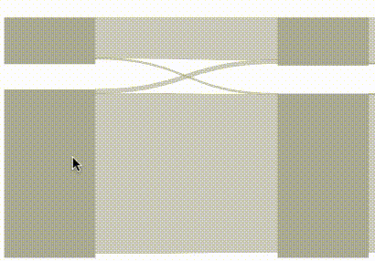

# [Alluvial Generator](https://alluvial.mapequation.org)

## Feedback
If you have any questions, feedback, or issues, please add them to the [issues page](https://github.com/mapequation/alluvial-generator/issues).

## Instructions

Networks are shown as vertical stacks of modules. To highlight change between networks, we draw
streamines between the networks. To tell which sub-modules that have the same parent module, we draw
them closer together than other modules in the same network.

### Navigation

Zoom in and out by scrolling. Pan the diagram by clicking and dragging.
To show module information, click on any module.

### Show sub-modules

By default, we show the top level modules for each network. To show the sub-modules
within any module, double click on it. If nothing happens, the module is already expanded
to its deepest level.

To keep the heights proportional to the contained flow, we re-scale the heights of all other modules.

### Regroup sub-modules

To regroup sub-modules into their parent module, double click on any sub-module while holding
the shift key.

All modules with the same parent will be re-grouped into the parent module.

## Supported formats
Currently, we support networks clustered by [Infomap](https://www.mapequation.org/code.html) into
the `clu`, `map`, `tree` and `ftree` formats.
To get hierarchical modules, you need to use the formats `tree` or `ftree`.

Read more about Infomap output formats on the [Infomap documentation page](https://www.mapequation.org/code.html#Output).
